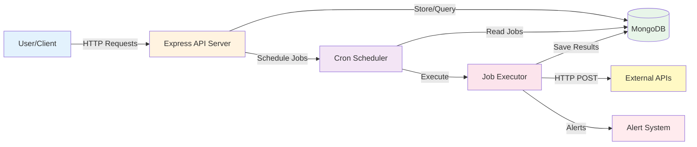

# High-Throughput Job Scheduler (B1.0)

## Problem Statement
Design and implement a simple yet scalable Job Scheduler capable of executing a large number of scheduled jobs with high accuracy and reliability.

## System Overview
The system supports:
1.  **Job Management**: Create, modify, and delete jobs.
2.  **Execution Tracking**: View instance runs of jobs.
3.  **Alerting**: Alert users on job failure.

The scheduler is designed to support thousands of job executions per second, where each job represents an HTTP POST request to an external API.

## Functional Requirements
-   **High Throughput**: Capable of handling thousands of executions per second.
-   **Job Types**: HTTP POST requests.
-   **Scheduling**: Custom CRON spec including Seconds (`31 10-15 1 * * MON-FRI`).
-   **Semantics**: At-least-once execution.
-   **Persistence**: Track all job executions and history.
-   **Accuracy**: Minimize drift from scheduled time.

## Tech Stack
-   **Runtime**: Node.js
-   **Framework**: Express.js
-   **Database**: MongoDB (Mongoose) due to its flexibility with JSON Job Specs and historical log storage.

## Architecture

### System Architecture Overview



### Component Overview

- **Express API Server**: Handles HTTP requests for job management (Create, Update, Delete, View)
- **MongoDB**: Stores job definitions and execution history
- **Cron Scheduler**: Monitors active jobs and triggers executions based on CRON schedules
- **Job Executor**: Executes HTTP requests to external APIs and records results
- **Alert System**: Monitors job failures and sends alerts


## Folder Structure
```
Job_scheduler/
├── Backend/
│   ├── src/
│   │   ├── controllers/    # Job management controllers
│   │   ├── routes/        # API route definitions
│   │   ├── models/        # Database models (Jobs, JobExecutions)
│   │   ├── utils/         # Cron scheduler and alert utilities
│   │   ├── db/            # Database connection
│   │   └── app.js         # Express application setup
│   ├── index.js           # Application entry point
│   ├── job_creation.js    # Test job generator script
│   ├── package.json       # Dependencies
│   └── .env               # Environment variables
└── Readme.md
```

## Getting Started

### Prerequisites
-   Node.js (v14+ recommended)
-   MongoDB (Running locally or URI)

### Installation
1.  Navigate to the Backend directory:
    ```bash
    cd Backend
    ```
2.  Install dependencies:
    ```bash
    npm install
    ```
3.  Configure Environment:
    Update `.env` with your MongoDB URI and DB Name.
    ```env
    MONGOOSE_URI=mongodb://localhost:27017
    DB_NAME=job_scheduler
    ```

### Running the Server
```bash
npm start
# Server runs on Port 3000 by default
```

## API Documentation

### 1. Create Job
-   **Endpoint**: `POST /create-jobs`
-   **Body**:
    ```json
    {
        "schedule": "31 10-15 1 * * MON-FRI",
        "api": "https://api.example.com/webhook",
        "type": "ATLEAST_ONCE"
    }
    ```
-   **Response**: `{ "jobId": "unique_id_123" }`

### 2. Get Job Executions
-   **Endpoint**: `GET /getjob-executions`
-   **Description**: Fetch last 5 executions.
-   **Response**:
    ```json
    [
        {
            "timestamp": "2023-10-27T10:00:31Z",
            "status": 200,
            "duration": "120ms"
        }
    ]
    ```

## Observability
-   Basic logging is implemented with console logs.
-   Future enhancements include metric collection (Prometheus) and distributed tracing.

##Sample Video link 
- https://drive.google.com/file/d/1NEpln1hY5Ssth1HBlGWJD6cFNzhnI_bM/view?usp=drive_web

## Sample Dataset
    [
        {
            "schedule": "* * * * *",
            "api": "https://api.example.com/ping",
            "type": "ATLEAST_ONCE",
            "description": "Ping every minute"
        },
        {
            "schedule": "*/5 * * * * *",
            "api": "https://api.example.com/data-sync",
            "type": "ATLEAST_ONCE",
            "description": "Sync data every 5 seconds"
        },
        {
            "schedule": "0 0 12 * * *",
            "api": "https://api.example.com/daily-report",
            "type": "ATLEAST_ONCE",
            "description": "Daily report at noon"
        }
    ]
